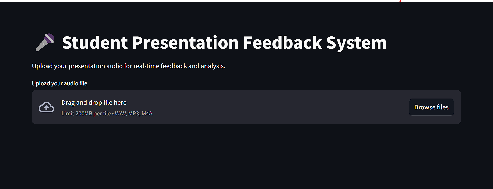

# 🎤 Real-Time Feedback System for Student Presentations

A smart feedback tool designed to analyze and improve students' oral presentation skills by evaluating **speech clarity**, **filler word usage**, **pacing**, **tone**, and **emotions**. This system offers **real-time or post-hoc feedback**, empowering students to reflect on and improve their communication effectiveness—an essential skill for computing and engineering professionals.

---

## 🚀 Project Goals

- Deliver **automated feedback** on spoken presentations  
- Support **oral communication skill development** in educational settings  
- Enable integration into **classroom assessments**, **peer feedback systems**, or **presentation workshops**

---

## 🎯 Key Features

- **Speech Clarity Analysis** – Evaluate pronunciation, enunciation, and speech rate  
- **Filler Word Detection** – Identify and count instances of words like *um*, *uh*, *like*, etc.  
- **Pacing Feedback** – Analyze speech tempo and detect monotony or inconsistency  
- **Tone and Emotion Recognition** – Detect vocal tone and emotional undertones  
- **Real-time or Post-hoc Feedback** – Use in live sessions or upload recordings  

---

## 🛠️ Tech Stack

| Component                 | Tool/Library          | Purpose                                 |
|--------------------------|-----------------------|-----------------------------------------|
| **Audio Analysis**       | `Librosa`             | Audio feature extraction                |
| **Speech-to-Text**       | `Whisper` (OpenAI)    | Accurate transcription of speech        |
| **Voice Activity Detection** | `py-webrtcvad`     | Detects active speech segments          |
| **NLP Feedback**         | `llaama 3`  | Generates natural language feedback     |
| **UI**                   | `Streamlit` | Web-based interactive interface      |

---

## 🎭 Emotion Detection in Voice

The system includes an emotion detection module that analyzes vocal tone to identify emotional states such as:

- Happy
- Sad
- Angry
- Neutral


---

## 📦 Installation

```bash
git clone https://github.com/your-username/student-presentation-feedback.git
cd student-presentation-feedback
pip install -r requirements.txt
```

---

## 📸 Screenshot



The application provides a user-friendly interface for uploading audio files and receiving detailed feedback on presentation skills. I am still working on this project.
